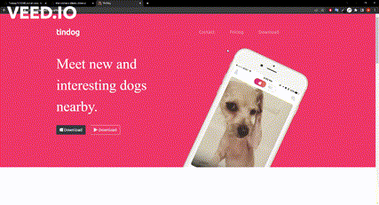

# TinDog

# Under development

Hello! This is the **TinDog** web site. 

I made this project based on the <a href="https://www.udemy.com/course/the-complete-web-development-bootcamp/">teacher Angela Yu</a> course challenge.

It's a simple site with a fictional and comical idea of being a tinder for dogs. In it I learned the first steps on how to use **CSS** to manipulate containers and images, z-index, basics of color and typography **Design** and how to use **Bootstrap**. I intend to implement it with JavaScript in the future and customize it more.

Feel free to contact me. Thanks for your visit!
