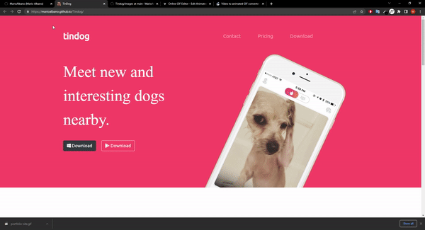

# TinDog

# Under development! / Em construção!

Hello! This is the **TinDog** web site. 

I made this project based on the <a href="https://www.udemy.com/course/the-complete-web-development-bootcamp/" target=_blank>Angela Yu</a> course first challenge.

It's a simple site with a fictional and comical idea of being a Tinder for dogs. In it I learned the first steps on how to use **CSS** to manipulate containers and images, z-index, basics of color and typography **Design** and how to use **Bootstrap**, also concerned with **Responsiveness**. I intend to implement it with JavaScript in the future and customize it more.

Feel free to contact me. Thanks for your visit!

-------------------------------------------------------------------------------------------------------------------------------------------------------------------------

Olá! Este é o web site **TinDog**.

Fiz este projeto baseado no primeiro desafio do curso feito pela <a href="https://www.udemy.com/course/the-complete-web-development-bootcamp/" target=_blank>Angela Yu</a>.

É um site simples com uma ideia ficcional e cômica de ser um Tinder para cachorros. Nele aprendi os primeidos passos de como usar o **CSS** para manipular container e imagens, z-index, básico sobre **Design** de cores e tipografia e também como usar o **Bootstrap**, com atenção a **Responsividade**. Eu pretendo implementar com **JavaScript** no futuro e customiza-lo ainda mais.

Sinta-se livre pra me contactar. Obrigado pela sua visita!
